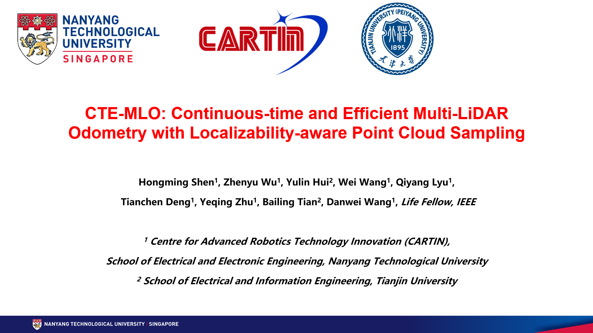

# CTE-MLO:
A Continuous-time and Efficient Multi-LiDAR Odometry with Localizability-aware Point Cloud Sampling.

Code is coming soon...

<!-- ## Demonstration Vedio:

    <a href="https://youtu.be/Q29PGPitHUI" target="_blank">
    

 -->

<!--  -->

## Features:
1. Continuous-time: A Gaussian process representation is adopted to describe the continuous-time trajectory, which enables a natural combination of the continuous-time LiDAR odometry with the Kalman filter.
2. Decentralized Multi-LiDAR Synchronization: combine multiple LiDAR measurements using the LiDAR splitting technique, which is robust to arbitrary LiDAR failure.
3. Efficient: A localizability-aware point cloud sampling method is proposed to improve the real-time performance of MLO, which quantifies the localizability contribution for each point, and ensures localizability using a minimal number of points with high localizability contribution.

## Acknowledgments
This project is developed based on [FAST-LIO2](https://github.com/hku-mars/FAST_LIO), [BALM](https://github.com/hku-mars/BALM), and [X-ICP](https://sites.google.com/leggedrobotics.com/x-icp). Thanks for their excellent work!
